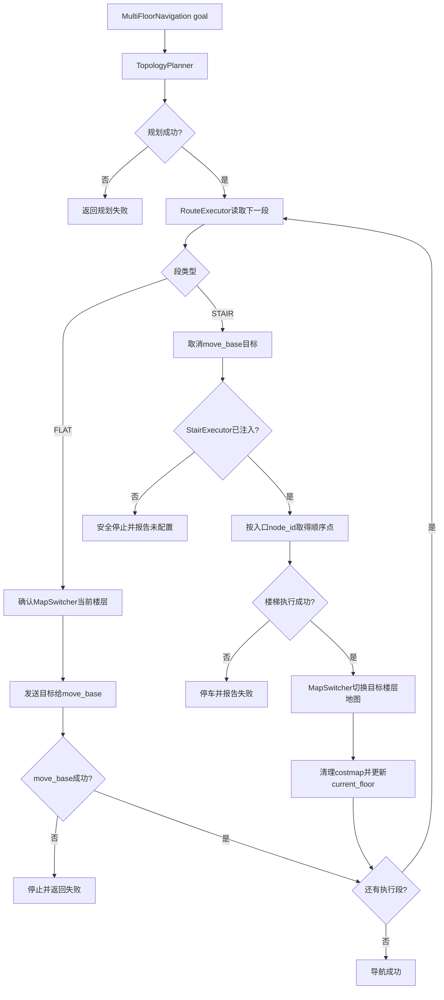

```mermaid
flowchart TD
    A[MultiFloorNavigation goal] --> B[TopologyPlanner]
    B --> C{规划成功?}
    C -- 否 --> X[返回规划失败]
    C -- 是 --> D[RouteExecutor读取下一段]
    D --> E{段类型}

    E -- FLAT --> F[确认MapSwitcher当前楼层]
    F --> G[发送目标给move_base]
    G --> H{move_base成功?}
    H -- 否 --> R[停止并返回失败]
    H -- 是 --> N{还有执行段?}

    E -- STAIR --> I[取消move_base目标]
    I --> J{StairExecutor已注入?}
    J -- 否 --> S[安全停止并报告未配置]
    J -- 是 --> K[按入口node_id取得顺序点]
    K --> L{楼梯执行成功?}
    L -- 否 --> S2[停车并报告失败]
    L -- 是 --> M[MapSwitcher切换目标楼层地图]
    M --> P[清理costmap并更新current_floor]
    P --> N

    N -- 是 --> D
    N -- 否 --> U[导航成功]
```

`TopoGraph`、`TopologyPlanner`、`RouteExecutor`和`MapSwitcher`位于同一个
`multi_floor_navigation_node`进程，但保持独立类。内部规划直接调用，
`get_topology_plan` service仅作为外部规划接口。
